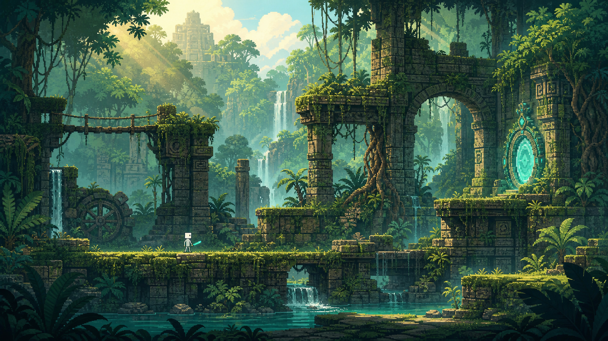

# 第二关美术风格设定：丛林遗迹

## 1. 核心定位

第二关的美术主题为“被丛林吞没的古代遗迹”。场景应体现潮湿、茂盛、神秘和探索感，同时保持纯 2D 横版游戏所需的路线可读性。

本关与第一关属于同一个世界，但通过气候与环境变化形成明显区别：第一关偏向冷色浮空遗迹，第二关进入阳光、藤蔓、水汽与古代石构共同组成的丛林区域。

## 2. 视觉关键词

- 丛林探索
- 失落神庙
- 苔藓石墙
- 藤蔓与树根
- 瀑布与浅水
- 潮湿薄雾
- 树冠光束
- 青色镜面能量

## 3. 色彩方向

| 用途 | 颜色方向 |
| --- | --- |
| 主环境色 | 翡翠绿、苔藓绿、灰绿色石材 |
| 阴影色 | 青绿、深蓝绿 |
| 光照色 | 柔和金色、浅黄色阳光 |
| 水体与雾气 | 青蓝、浅青绿 |
| 镜门与能力特效 | 高亮青色、少量蓝白色 |
| 危险提示 | 低饱和橙红色，控制使用面积 |

整体保持“绿色环境＋金色阳光＋青色镜能”的关系。镜面能量应比环境色更明亮，以确保镜门、瞬移残影和箭矢特效清晰可见。

## 4. 场景分层

### 前景

使用深色的大型叶片、垂落藤蔓和局部石块构成画面边框。前景不能遮挡玩家、敌人、箭矢或可行走平台。

### 游戏层

游戏层由苔藓石台、残破神庙地面、木桥和机关组成。可行走边缘必须轮廓清晰，苔藓和植物不能覆盖碰撞边界。

### 中景

使用断裂拱门、石柱、神庙墙体、树根和小型瀑布强化空间主题。中景细节应服务于路径引导，避免与游戏层争夺视觉注意力。

### 远景

使用低对比度的树冠、山谷、失落神庙轮廓和多层瀑布形成纵深。远景颜色更浅、更偏青，以表现潮湿空气和距离。

## 5. 材质语言

- 石材：表面开裂、边缘磨损、局部长满苔藓，但主要结构仍应清楚。
- 木材：潮湿、发黑、绳结明显，用于吊桥和配重机关。
- 植物：以藤蔓、蕨类、阔叶植物和树根为主，避免把可玩区域完全覆盖。
- 水体：用于瀑布、浅水和滴水效果，不作为主要伤害区域。
- 镜面：保持光滑、寒冷、非自然的青色光泽，与潮湿粗糙的自然材质形成对比。

## 6. 光照与气氛

主光源来自树冠缝隙中的阳光，形成斜向光束。阴影区域使用青绿色环境光，使角色和平台仍然可读。

可加入以下环境动态：

- 缓慢飘动的水汽与花粉；
- 轻微摆动的藤蔓和树叶；
- 石壁滴水与瀑布水雾；
- 玩家经过时被惊动的小鸟或昆虫；
- 镜门附近违反自然风向的青色粒子。

## 7. 角色与场景比例

玩家继续使用现有的小比例白灰色无脸角色和青绿色细剑。场景设计必须以实际角色尺寸为基准，不使用概念插画式的大人物比例。

- 常规平台高度约为角色身高的 0.5 至 1.5 倍。
- 需要跳跃跨越的落差必须符合现有移动参数。
- 可攻击的绳索和机关应位于剑招能够稳定命中的高度。
- 植物和石雕可以巨大，但不能影响角色、箭矢和机关的辨识。

## 8. 玩法相关的视觉规则

- 玩家依靠移动和跳跃躲避箭矢，不设置掩体机制。
- 箭矢必须与绿色背景区分，可使用浅色箭身、青白拖尾或短暂轮廓光。
- Boss 瞬移前，在目标位置提前出现破碎镜纹和短暂亮光。
- Boss 短暂飞行时，其地面落点需要有清晰提示。
- 配重吊桥机关的绳索应比普通藤蔓更规整，并使用轻微高亮区分。
- 绳索、滑轮、配重和竖起的桥板应尽量出现在同一镜头内，确保机关因果关系清楚。

## 9. 现实与镜中区域的区别

### 现实丛林

温暖、湿润、具有生命力。以金色阳光、绿色植物、流水和自然摆动为主。

### 镜中丛林

保持同一套遗迹结构，但降低植物饱和度，让叶片趋向蓝绿或灰白。水流可出现倒流，镜片悬浮，树根朝不自然的方向生长。主要光源转为冷青色和少量紫色。

现实与镜中区域必须保持空间对应关系，让玩家感到进入了同一地点的异常镜像，而不是另一个完全无关的世界。

## 10. 避免事项

- 不使用写实 3D 镜头或强烈透视构图。
- 不把玩家重新设计成长袍、盔甲或写实人物。
- 不让前景植物遮挡玩家和攻击。
- 不让绿色环境吞没箭矢、镜门和交互机关。
- 不堆叠过多小平台，避免破坏探索感和路径判断。
- 不将场景做成纯森林；古代遗迹仍然是主要建筑语言。

## 11. 一句话美术目标

> 玩家穿行在阳光与水雾笼罩的失落丛林神庙中，古老石构正在被自然吞没，而青色镜面能量像不属于这里的伤口一样潜伏在遗迹深处。
