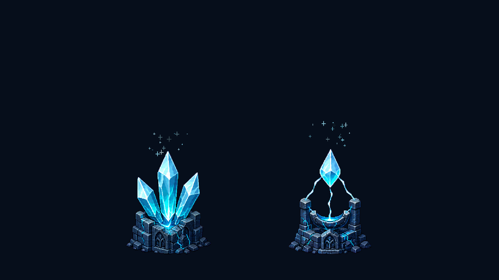
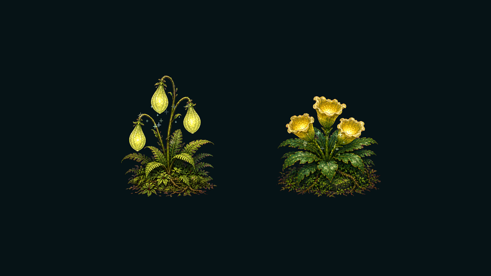

# 第一关生命资源美术设计

## 视觉定位

第一关生命资源沿用冷色浮空遗迹的画面语言：深蓝灰残破石构承载青白色镜能，避免使用第二关植物资源的暖黄、苔绿和潮湿丛林材质。资源轮廓保持紧凑，放在平台边缘或战斗路径中仍能一眼识别为可攻击物件。

## 资源方案

| 资源 | 关卡用途 | 耐久 | 生命储备 | 视觉识别 |
| --- | --- | ---: | ---: | --- |
| 裂光晶簇 `HealthResource_RiftlightCrystal` | 常规路径与小平台奖励 | 3 次命中 | 2 | 三根青色镜晶从哥特石基座中生长，低矮、横向紧凑 |
| 镜露圣龛 `HealthResource_MirrorDewReliquary` | 战斗后或岔路的高价值奖励 | 4 次命中 | 3 | 悬浮镜露由残破圣龛托举，纵向轮廓更醒目 |

两种资源均提供完整、轻度受损、重度受损和耗尽四张状态图，由 `HealthResourcePlantView` 根据当前耐久切换。

## 未采摘闪光

所有正式生命资源 Prefab 都带有双层待采集提示：`IdleSparkleParticles` 与 `FocusFlashBurst`：

- 常驻微粒每秒约发射 8 个，使用青白或黄白十字闪光，缓慢上浮并淡入淡出。
- 焦点闪星约每 0.95 秒爆发 2–3 个，尺寸明显大于常驻微粒，用于远距离提示。
- 粒子改用 URP 加法发光材质，并集中在花苞、晶体或镜露核心附近。
- 粒子数量保持克制，避免与攻击提示、镜门裂光争夺注意力。
- `HealthResourcePlantGlow` 会在资源耗尽时停止发射粒子；Prefab 隐藏后粒子随节点一同停用。
- 第一关资源使用冷青色，第二关两株植物保留暖黄绿色，从颜色上区分关卡生态。

## 资产位置

- 第一关状态贴图：`Assets/MirrorTrial/Art/Level01_Ruins/LifeResources`
- 第一关 Prefab：`Assets/MirrorTrial/Prefabs/Level/Resources/HealthResource_RiftlightCrystal.prefab`
- 第一关 Prefab：`Assets/MirrorTrial/Prefabs/Level/Resources/HealthResource_MirrorDewReliquary.prefab`
- 预览图：`Assets/MirrorTrial/Art/Previews`
- 生成与重建工具：`Tools → Mirror Trial → 关卡 → 生成第一关生命资源与补充闪光`

两套新 Prefab 已注册到 `HealthResourceCatalog`，可以直接从关卡编辑器的生命资源仓库中选择并放置。
